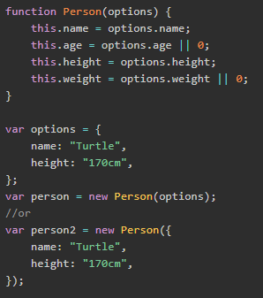

## TypeScript

### 1.安装与简介

安装：

```js
npm install -g typescript	//全局安装typescript
tsc index.ts   //解析成js文件
tsc --init  	//生成配置文件
```

vscode自动编译ts文件：

1.项目里面：tsc --init，生成配置文件tscconfig.json；

2.点击任务--运行任务，点击**监视**tscconfig.json；


简介：

typescript就是js的高级写法，相当于less之于css；

体验：强类型，接口，


### 2.数据类型

#### 2.1 基础数据类型

1.Boolean类型

2.数字类型

3.string类型

4.数组类型，元组类型（可以是number，string）；

5.枚举类型：枚举类型用于定义数值集合；

```js
var flag:boolean=true;
var num:number=123;

var str:string='this is true';
let words: string = `您好，今年是 ${ name } 发布 ${ years + 1} 周年`;

var arr:number[]=[11,12,13];
var arr:Array<number>=[11,12,13];

let arr:[number,string]=[11,'123'];//元组类型

//枚举类型
enum Color { blue,red='redcolor'};
let c:Color = Color.blue;
console.log(c); //0，没有指定值的时候，就返回的是索引值，有值就返回对应的值
```

#### 2.2 任意类型、null、undefined、void

1.任意类型：any

```js
var num:any='123';
num=true;
```

因为ts里面没有object数据类型，所以可以使用any；

2.null和undefined

```js
var num2:number | null | undefined;
console.log(num2);
```

3.void：表示方法没有返回值；

```js
function run():void{
    console.log('run');
}
//有返回值，类型是number
function run1():number{
    return 123;
}
```

4.never类型：代表从不会出现的值；在函数中它通常表现为抛出异常或无法执行到终止点（例如无限循环）

```js
var a:never;
a = (()=>{
    throw new Error('exception');
})()
```

### 3.函数

#### 3.1 函数的定义

函数声明法，匿名函数；

```js
//传入参数，指定参数类型；指定返回值类型
function getInfo(name:string,age:string):string{
    return `${name}---${age}`
}
```

#### 3.2 可选参数

ES5中一种简便的解决方法是不定义这么多的参数赋值，而统一使用一个对象来进行赋值：



```js
//使用？
function getInfo1(name:string,age?:number):string{}
```

#### 3.3 默认参数

```js
//使用=
function getInfo1(name:string='小明',age?:number):string{}
```

#### 3.4 剩余参数

```js
//使用...运算符
function sum(...res:number[]):number{
    var sum=0;
    for(var i=0;i<res.length;i++){
        sum+=res[i];
    }
    return sum;
}
```

#### 3.5 函数重载

重载是方法名字相同，而参数不同，返回类型可以相同也可以不同。

```js
function disp(s1:string):void; 
function disp(n1:number,s1:string):void; 
function disp(x:any,y?:any):void { 
    console.log(x); 
    console.log(y); 
} 
disp("abc") 
disp(1,"xyz");
```

### 4.类、静态方法、继承

```js
类：很像es6里面的class；
静态方法：static，直接使用构造函数/类名进行调用；
继承：extends/super进行继承；
```

类的修饰符：public，private，protected

public：公有的；类、子类、类外部都可访问；

protected：保护类型，类外部无法访问；

private：私有的；子类、类外部都不能访问；