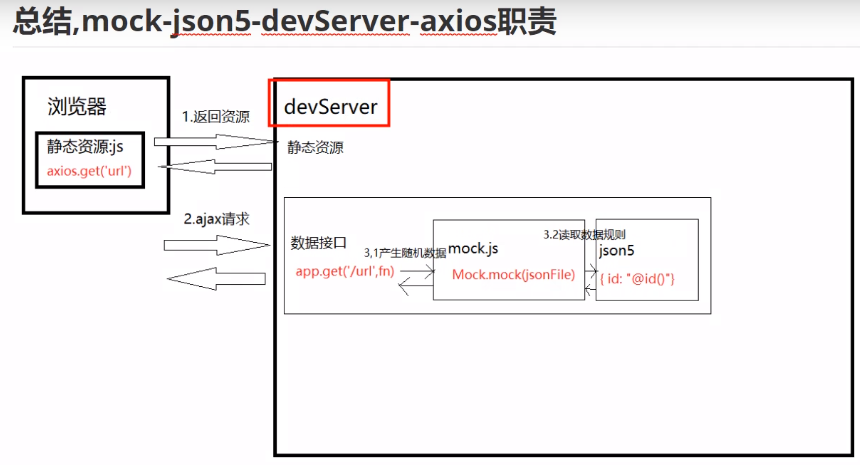
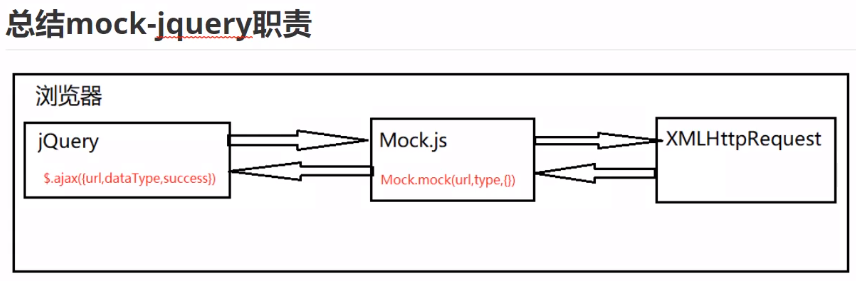

## mock数据

### 1.介绍

前端本地模拟数据：mock.js插件，模拟数据；

### 2.项目安装与配置

结合vue项目进行开发使用；

```js
vue create mock-demo
npm install axios --save
npm install mockjs --save-dev	//生成随机数据
npm install json5 --save-dev	//使用json5解决json文件，无法添加注释问题
```

在项目中创建mock文件夹，创建testmock.js

```js
const Mock=require('mockjs')
let id=Mock.mock('@id')

let obj=Mock.mock({
    id:'@id'
})

//随机生成的数据
{ id: '810000199112053337' }
```

### 3.配置json5格式

写json文件的时候，需要都加上“”，json5文件不需要；

```js
const fs=require('fs')
const path=require('path')
const JSON5=require('json5')

var strobj = fs.readFileSync(path.join(__dirname,'./userinfo.json5'),'utf-8')
var obj = JSON5.parse(strobj)	//将下面的字符串转换成obj对象
console.log(obj);


//userinfo.json5文件里面配置的变量
{
    id:"@id()",
    username:"@cname()",
    date:"@date()",
    avatar:"@image('100×100','red','#fff','avatar')",
    description:"@paragraph()",
    ip:"@ip()",
    email:"@email()"
}
```

### 4.mock和vue-cli结合，devserver结合调用

```js
//在vue.config.js里面进行配置devserver，拦截请求
module.exports={
    devServer:{
        before:require('./mock/index.js')
    }
}

//mock/index.js里面配置请求数据的接口：/user/info
const fs=require('fs')
const path=require('path')
const Mock=require('mockjs')
const JSON5=require('json5')

function getJsonFile(filepath){
    var strobj = fs.readFileSync(path.join(__dirname,filepath),'utf-8')
    return JSON5.parse(strobj)
}

module.exports = function(app){
    app.get('/user/info',function(req,res){
        var json = getJsonFile('./userinfo.json5')
        res.json(Mock.mock(json))
    })
}
```

### 5.移除mock代码

通过设置环境变量来改变参数：新建一个.env.development文件，里面进行配置：MOCK=false

```js
//process.env.MOCK == 'true'

module.exports = function(app){
    if(process.env.MOCK == 'true'){
        app.get('/user/info',function(req,res){
            var json = getJsonFile('./userinfo.json5')
            res.json(Mock.mock(json))
        })
    }
}

```


------

### vue-mock原理

主要是使用的脚手架，使用webpack-devserver进行拦截请求，浏览器发送请求，被devserver拦截后，然后返回mock数据；




### jquery-mock原理

都是在浏览器里面进行操作的，



------

### 1.jquery-mock的使用

```js
//引入文件
1.jquery：2.2.4版本
2.mock-min.js：1.0.0版本

//mock.js里面进行配置
Mock.mock('/user/userinfo','get',{
    id:"@id()",
    username:"@cname()",
    date:"@date()",
    avatar:"@image('100×100','red','#fff','avatar')",
    description:"@paragraph()",
    ip:"@ip()",
    email:"@email()"
})

//在index.html里面进行发送ajax请求
<script>
    $.ajax({
        url:'/user/userinfo',
        dataType:'json',
        success:(data)=>{
            console.log(data)
        }
    })
</script>
```

### 2.移除mock

1.直接注释mock.js即可；

2.加上变量进行判断：mock=true

