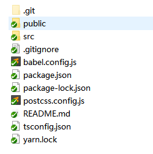
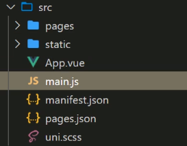
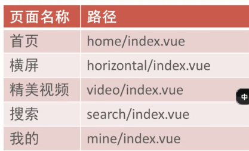

## Uniapp

### 1.项目创建

```js
npm install -g @vue/cli
vue create -p dcloudio/uni-preset-vue dongnizhaotu
npm run dev:mp-weixin      //编译生成dist文件夹
使用微信小程序开发工具导入项目：地址是 dist/dev/mp-weixin
```



目录结构：

public：里面是给pc网页开发提供模板的；

src：主要是在这里面进行开发；

  pages：里面是写页面的； static：存放静态资源的；

 App.vue：相当于app.js（生命周期函数，导入css文件）；

 main.js：入口文件；挂载的；

 pages.json：页面的配置；uni-scss：upx单位，变量等；




### 2.样式

使用的是sass，需要安装依赖

```js
npm i sass-loader node-sass
在style标签里面加上  lang="scss"
```

### 3.基础语法

{{}}：使用变量；

:data-color:"color"，自定义属性前面加上冒号；

```js
vue的语法： 前面加冒号，:goodslist="goodslist"
小程序的语法：title="{{titles}}"
```


循环数组，和vue的语法一样；

```js
v-for="(item,index) in list" :key="item.id"
```


条件编译：v-if，v-show

适合频繁使用：v-show；只是css样式的改变；

不适合频繁使用：v-if；直接dom元素有无；


计算属性：computed

### 4.事件的基本使用

```js
@click="handlechange($event)"
data-index自定义属性的方式传参，那就使用event.currentTarget.dataset.index获取属性（小程序写法）
```

vue：

```js
data-radius='100'
event.target.dataset.index
```

### 5.组件的使用

组件传值，组件的注册，和vue是一样的；

全局共享数据实现的方式：

1.通过vue的原型prototype共享数据；

2.globalData（小程序的写法），获取数据

getdata().globalData.baseurl


vue中组件传值：

props，$children，$parent，$on，$emit，Ref，slot，vuex，event bus，$attrs，$listeners

### 6.插槽

slot的使用；

### 7.生命周期

生命周期和小程序差不多


------

### 1.创建项目

启动项目：npm run dev:mp-weixin

创建项目tabbar：pages.json，配置信息看官网；



基本样式的导入：在app.vue中配置

```js
<style>
	@import "./styles/iconfont.wxss";
	@import "./styles/base.wxss";
</style>
```

#### 1.1 uni-ui使用

安装uini-ui，局部引入组件，使用组件；

```js
npm install @dcloudio/uni-ui
import {uniBadge} from '@dcloudio/uni-ui'   //在页面的script中直接引入
components: {uniBadge}    //注册组件
```

