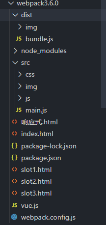

## webpack3.6.0

### 1.定义

**前端模块化打包工具**；

模块化：AMD，CMD，CommonJS，ES6；一个文件导出，导入，很复杂；

打包：把这些文件打包成浏览器能识别的文件；可以帮我们处理模块间的依赖关系；让我们进行模块化开发；

### 2.安装与简单使用

环境：node

vue cli2    webpack 3.6.0

```javascript
CommonJS：
module.exports = {sum,mul};    		const {sum,mul} = require('./math');
ES6： 
export default sum  /  export  const sum....        import {sum，mui} from './math'

npm install webpack@3.6.0 -g    //全局安装
npm install webpack@3.6.0 --save-dev   //项目本地安装
webpack ./src/main.js ./dist/bundle.js     //用webpack打包main.js文件成 bundle.js
```



dist文件夹：主要是放置编译后的文件；

src：进行模块化开发的js文件（使用不同的模块化语言），编译的是main.js（入口文件：包含了很多文件的依赖）

index.html文件，使用的就是src里面打包好的bundle.js文件（里面就是打包好的js，css，图片）；

### 3.webpack.config.js和package.json

```javascript
npm init 		//初始化文件，输入一些信息以后就会自动生成package.json，就是告诉你项目信息
npm install  	//下载依赖包
webpack  		//直接敲命令，用的是全局的webpack，可能版本不一致；
npm run build 	//先去本地项目找webpack，再去全局找webpack
```

比如：电脑上装的webpack是4.1.0，但是项目是3.6.0；执行webpack，那就是4.1.0，可能会出错；

所以一般用的是本地项目的webpack；

```javascript
-g   			全局安装
--save-dev   	只是开发时依赖
--save    		运行时依赖

"devDependencies": {	//开发时依赖，项目打包后不需要了
    "webpack": "^3.6.0"
},
"dependencies": {		//运行时依赖，项目打包后还想用到的依赖，比如vue
}
```

```javascript
//配置信息webpack.config.js
const path = require('path')
module.exports = {
    mode:'development',//模式：production  development
    entry:'./src/main.js',//定义打包入口文件
    output:{
        path:path.resolve(__dirname,'dist'),	//绝对路径
        filename:'bundle.js',	//打包后的文件名
        publicPath:'dist/'      //图片打包的路径
    }
}
```

```javascript
//对命令进行映射，package.json里面配置
"scripts": {
    "test": "echo \"Error: no test specified\" && exit 1",
    "build":"webpack"
  },
```

### 4.loader

除了js文件，还有scss，less，.vue，.jxs，图片，typescript等文件转换成js，css文件；

所以需要扩充loader；不同的文件处理需要不同的loader；

步骤一：通过npm安装需要使用的loader；

步骤二：在webpack.config.js中的modules关键字下进行配置；

```javascript
main.js里面导入css文件：   require('./css/normal.css');

npm install css-loader style-loader --save-dev
npm install --save-dev less-loader less
npm install --save-dev url-loader file-loader

module.exports = {
  module: {
    rules: [
      {
        test: /\.css$/,
        use: [ 'style-loader', 'css-loader' ]
      },
    {
        test: /\.(png|jpg|gif)$/,
        use: [
          {
            loader: 'url-loader',
            options: {
              limit: 8192,
              name:'img/[name].[hash:8].[ext]'   //给图片文件进行命名
            }
          }
        ]
      }
    ]
  }
}
```

配置的时候，有limit配置项：8192  ，8kb

小于limit时，会将图片地址：转换成base64的字符串；

大于limit时，需要使用file-loader，打包后会自动将图片复制打包到dist文件夹下，所以需要使用dist文件夹下图片；background: url(dist/5148503….jpg);


ES6转换成ES5，使用babel，搜不到const了

```javascript
npm config set registry https://registry.npm.taobao.org
npm install --save-dev babel-loader@7 babel-core babel-preset-es2015
注意：presets: ['es2015']
```

### 5.配置vue

```javascript
npm install vue --save
main.js     导入vue，并进行实例挂载；

webpack.config.js文件，要配置vue，使用runtime-compiler
resolve:{
      alias:{
        'vue$':'vue/dist/vue.esm.js'
      }
    }
```

runtime-only：代码中，不可以有任何的template

runtime-compiler：代码中，可以有template；

过程：

```javascript
main.js里面：
const App = vue.extend({
    template:``,
    data(){},
    methods:{}
})

export default {
  el:"#app",
  components:{
    App
  }
}

el和template的区别：加载的时候，会把el的内容用template替换掉；
```

接着就把app组件放在app.vue文件里；

在main.js中，直接导入app.vue就好；但是webpack不能识别vue文件，所以需要下载vue-loader，vue-template-compiler，并进行配置；


------

