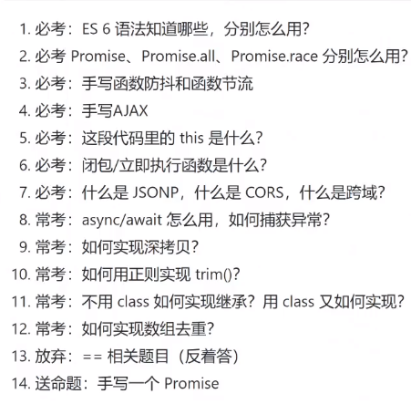
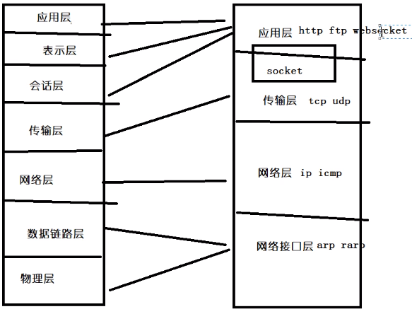

## 面试题




## html和css

### 1. flex布局（2）

应用在**flex-container**的css属性：

| 属性                                                         | 用途                       |
| ------------------------------------------------------------ | -------------------------- |
| **flex-direction**: row \| row-reverse \| column \| column-reverse; | 决定主轴的方向             |
| **flex-wrap**: nowrap \| wrap \| wrap-reverse;               | 如何换行                   |
| **flex-flow**: <flex-direction> \|\| <flex-wrap>;            | 上面两个的简写             |
| **justify-content**: flex-start \| flex-end \| center \| space-between \| space-around; | 决定在主轴上的对齐方式     |
| **align-items**: flex-start \| flex-end \| center \| baseline \| stretch; | 决定项目在交叉轴上如何对齐 |
| **align-content**: flex-start \| flex-end \| center \| space-between \| space-around \| stretch; | 定义多根轴线的对齐方式     |

应用在**flex-items**的css属性：

| 属性                                                         | 用途                                     |
| ------------------------------------------------------------ | ---------------------------------------- |
| **order**: <integer>;                                        | 定义项目的排列顺序：默认0                |
| **flex-grow**: <number>;                                     | 定义项目的放大比例：默认0                |
| **flex-shrink**: <number>;                                   | 定义项目的缩小比例：默认1                |
| **flex-basis**: <length> \| auto;                            | 项目占据的主轴空间：默认auto             |
| **flex**: none \| [ <'flex-grow'> <'flex-shrink'>? \|\| <'flex-basis'> ] | 简写：flex：1表示啥？                    |
| **align-self**: auto \| flex-start \| flex-end \| center \| baseline \| stretch; | 允许单个项目有与其他项目不一样的对齐方式 |

### 2.BFC原理及其应用

1.常见的定位方案：

普通流：行内，块级元素；

float：文本环绕；

绝对定位：元素会整体脱离普通；

2.BFC：Block Formating Context，块级格式化上下文，属于普通流； 可以看做一个密封的大箱子；对外面毫无影响；

**3.触发BFC**

只要元素满足下面任一条件即可触发 BFC 特性：

- body 根元素
- 浮动元素：float 除 none 以外的值
- 绝对定位元素：position (absolute、fixed)
- display 为 inline-block、table-cells、flex
- overflow 除了 visible 以外的值 (hidden、auto、scroll)

**4.BFC的特性及其应用**

1. 同一个 BFC 下外边距会发生折叠（放在不同的BFC容器里面）
2. BFC 可以包含浮动的元素（应用：清除浮动）
3. BFC 可以阻止元素被浮动元素覆盖（应用：两栏自适应）

### 3.让div垂直水平居中（1）

https://muyiy.cn/question/css/52.html

```javascript
1.flex布局
  父：display:flex; justify-content: center;   align-items: center;
  父：display:flex;  子：margin:auto;

2.定位：子绝父相
  子：top：50%；left: 50%; transform: translate(-50%, -50%);  
  子：top：50%；left: 50%; margin-left: -25px;  margin-top: -5px;
  子：left: 0;top: 0;right: 0;bottom: 0;margin: auto;

3.grid定位（更强大的flex）
  父：display: grid;
  子：justify-self: center; align-self: center;
```

### 4.不显示元素节点

display：none；     opcity：0；       visibility: hidden;

1. display: none (不占空间，不能点击，不被继承)（场景，显示出原来这里不存在的结构）
2. visibility: hidden（占据空间，不能点击，可以继承）（场景：显示不会导致页面结构发生变动，不会撑开）
3. opacity: 0（占据空间，可以点击，可以继承）（场景：可以跟transition搭配）

### 5.圣杯布局/双飞翼布局（左侧固定，右侧自适应）

双飞翼布局：

```html
<div id="container" class="column">
    <div id="center"></div>
</div>
<div id="left" class="column"></div>
<div id="right" class="column"></div>
```

圣杯布局：

```xml
<div id="container">
  <div id="center" class="column"></div>
  <div id="left" class="column"></div>
  <div id="right" class="column"></div>
</div>
```

左右两栏200px，150px，中间宽度100%，自适应；

```css
<!-- DOM结构 -->
<div id="container">
  <div id="center"></div>
  <div id="left"></div>
  <div id="right"></div>
</div>

#container {
    display: flex;
}

#center {
    flex: 1;
}

#left {
    flex: 0 0 200px;
    order: -1;
}

#right {
    flex: 0 0 150px;
}
```

### 6.URL的详细解析过程

协议，主机名，端口号，路径，query参数

输入www.baidu.com，就会DNS域名解析，找到百度的ip地址，服务器收到请求，就会返回数据；

### 7.transition和animation的使用

transform：属性，位移，旋转角度

transition：过渡效果，属性，宽度，高度这些进行过渡

animation：动画属性；

### 8.浏览器内核

负责解析网页语法，渲染（显示）页面


### 9.文字换行处理

```css
.right{
  flex:7;
  overflow: hidden;
}

.title,
.desc{
    display: inline-block;
    white-space: nowrap; 
    width: 100%; 
    overflow: hidden;
    text-overflow:ellipsis;
}
```

### 10.伪类和伪元素

伪类：为已经存在的dom元素添加样式，根据用户的行为动态变化；分为状态性伪类和结构性伪类；

​			状态性伪类：hover，focus ，link，active

​			结构性伪类：first-child，empty ，checked

伪元素：不在dom树中的元素，并为其添加样式；双冒号表示；

​			比如：before ，after，first-letter

### 11.html5的新特性

    （一）语义标签：article、footer、header、nav、section
    （二）增强型表单：calendar、date、time、email、url、search
    （三）视频和音频：video 和 audio 元素
    （四）Canvas绘图
    （五）SVG绘图
    （六）地理定位
    （七）拖放API
    （八）WebWorker：运行在后台的js脚本，不影响页面性能；
    （九）WebStorage：localStorage，sessionStorage
    （十）WebSocket：协议之类的；
    （十一）Application Cache：manifes应用程序缓存
### 12.高度塌陷，清除浮动

```css
.clearfix:after {
	content: "";  // 设置内容为空
	height: 0;  // 高度为0
	line-height: 0;  // 行高为0
	display: block; // 将文本转为块级元素
	visibility: hidden; // 将元素隐藏
	clear: both; //清除浮动
}
.clearfix {
	zoom: 1;  // 为了兼容IE
}
```

### 13.上传文件

```js
1.上传文件：input  file
2.输出文件信息：
var file = document.querySelector("#file")
file.onchange = function(e){
    console.log(e.target.files)   //文件对象
}
3.读取文件对象：FileReader
//创建对象
var reader = new FileReader();
//读取文件内容
reader.readAsDataURL(e.target.files[0])

//显示在页面中
reader.onload =function(){
    img.src = this.result
}
```

------

14.使用自适应布局的时候用rem，为什么可以自适应布局？

不同的手机端，字体大小不一样？拿到UI给的图片是怎么进行计算的？/16px，基于什么来的？

15.盒模型有哪些？有什么区别？bootstrap用的是什么模型？


## JavaScript

### 1.防抖和节流

**防抖**：触发高频事件后n秒内函数只会执行一次，如果n秒内高频事件再次被触发，则重新计算时间

思路：每次触发事件时都取消之前的延时调用方法（第一次进来，timer赋值了，但是func没有被执行，要等待执行），第二次，timer直接被清除了；

场景：多次输入，输入完成后，等1秒，没有事件触发了才发送网络请求

```javascript
function debounce(func,delay = 1000){
    let timer = null;
    return function(){
        if(timer){
            clearTimeout(timer);
        } 
        timer = setTimeout(func,delay)
    }
}
```

**节流**：高频事件触发，但在n秒内只会执行一次，所以节流会稀释函数的执行频率

思路：每次触发事件时都判断当前是否有等待执行的延时函数（一：时间戳；二：闭包标记）

场景：多次输入，隔几秒才显示出来

```javascript
function throttle(func,delay = 1000){
    let timer = null;
    return function(){
        if(!timer){
            timer = setTimeout(function(){
                func();
                timer = null;
            },delay)
        }
    }
}

var show = function(){
     var scrollTop = document.body.scrollTop || document.documentElement.scrollTop;
     console.log('滚动条位置：' + scrollTop);
}
window.onscroll = debounce(show)
```

### 2.箭头函数

1.this指向：定义的时候的this，继承的父元素的this；

回调函数中的this，是window。所以可以用箭头函数来指向对象；

2.不能使用的场景：

  构造函数的方法，需要使用arguments参数

### 3.for  in和for of

foreach：不能终止循环；

for in：循环的是index，属性值，会遍历出数组的所有属性（加载原型上的）

**for of**：可以循环很多数据结构；可以循环终止：break，continue；还可以循环遍历器；部署了iterator接口的，就可以使用for of循环；arr、string、arguments

### 4.一维数组和多维数组

多维转一维：

1.ES6的flat方法，flat(Infinity))；

2.先转成字符串toString，再使用split进行分割，最后再转换成数字（+str）就行了

3.使用扩展运算符，ary.some(Array.isArray)

4.replace方法进行正则取值，再split

5.递归查询

### 5.数组去重

1.reduce

````js
let newarr = arr.reduce((pre,cur)=>{
    if(!pre.includes(cur)){
        return pre.concat(cur)
    }else{
        return pre
    }
},[])
````

2.for循环，splice

两层循环，第二层循环的时候，如果相等，那就删掉第二个数，j--

3.for循环，indexOf来判断

​	新建一个空数组，循环原来的数组，不存在就是-1，然后push进去

4.set方法

let newarr = Array.from(new Set(arr))

### 6.ES6的新特性

1.let，const声明变量，作用域，没有变量提升，先定义后使用；变量名不能重复；

2.形参函数设置默认值

3.箭头函数，没有this

4.数据的解构赋值

5....扩展运算符

6.promise对象，进行异步调用，resolve，reject

7.async/await，把异步请求转为同步操作

### 7.ajax原理及封装

### 8.http，tcp/ip

### 9.浏览器兼容性

### 10.性能优化

### 11.websocket技术

12.跨域，限制了什么？不同源的话会进行什么策略，跨域的方式有哪些？

jsonp，nigix代理，websocket，php修改header

12.this的指向

13.promise和async，awit，generator使用场景？

14.ES6的新特性

15.let，var，const

16.给定三行表格，如何删除第一行？

17.awit为什么出现？能解决什么问题？

18.扁平化数组的方法

array.flat方法

正则表达式进行匹配

json.parse

递归

reduce

...

19.判断数组

20.vue-cli底层是怎么实现的？

21.原型和原型链（画图）

22.怎么改变this指向？

使用箭头函数，使用变量that进行保存this，使用bind，apply，call，new一个实例化对象；

非严格模式：window；严格模式下：undefined；

23.new是怎么实现的？

红宝书

24.清除浮动的方法

25.webpack，配置和使用loader

26.http的cache-control作用？

27.同源的标签里面怎么传递数据？

localstorage，没有安全性；

可以使用websocket；

28.cmd和amd的区别？


------

## vue

### 1.axios是怎么实现的?

2.vue的生命周期，destory周期是干啥的？

mounted和created区别

3.组件传值

4.keep-alive的原理和功能？

5.vue的双向数据绑定？

6.组件中的data为什么是函数？

创建对象

7.vue写插件的时候，有一个核心方法install，是怎么实现的？

8.vue的slot，具名插槽


算法

1.手动实现一个对象绑定一个方法

2.触发一个方法

3.移除一个方法

## websocket


